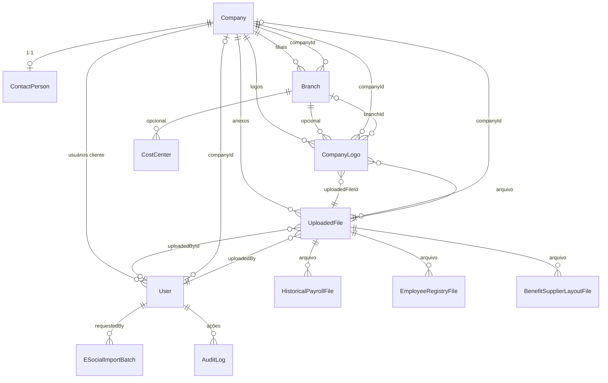
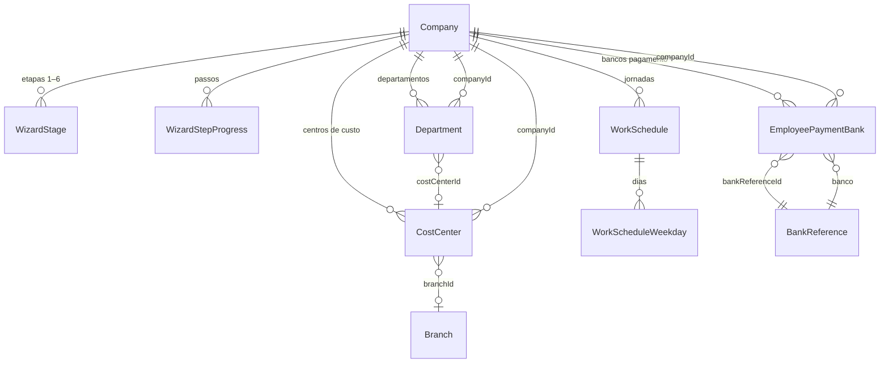
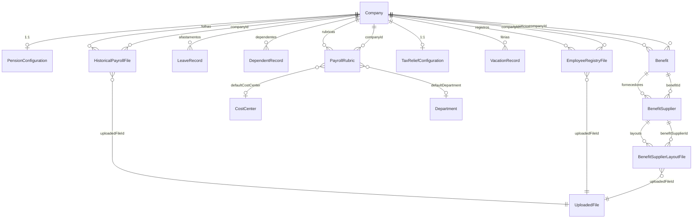
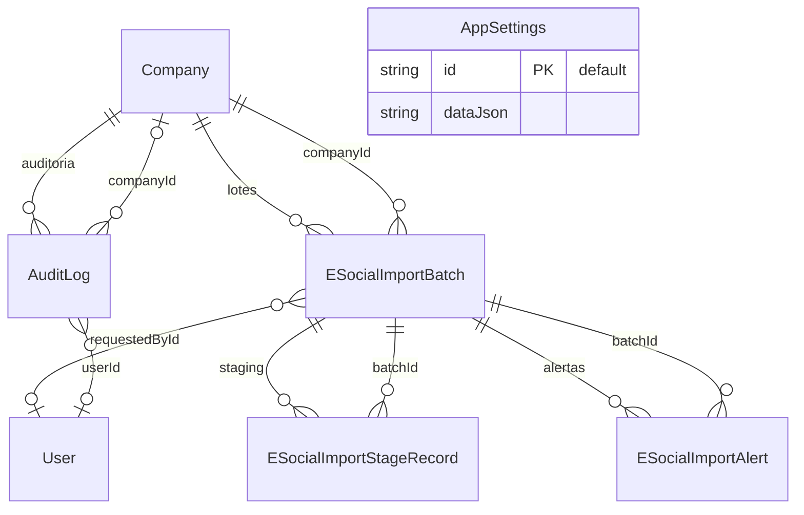

# Diagrama do banco de dados (Prisma)

Gerado a partir de `backend/prisma/schema.prisma` (SQLite).  
Enums e domínios de string estão em `backend/src/common/prisma-enums.ts`.

## Visão geral — núcleo, usuários e arquivos

## Wizard e parametrização operacional

## Base histórica, benefícios e rubricas

## eSocial, auditoria e configuração global

## Legenda

- `||--o{` — um (obrigatório) para muitos (opcional)
- `||--o|` — um para zero ou um
- `}o--||` — muitos para um (FK do lado “muitos”)

**Observação:** `PayrollRubric` referencia `CostCenter` e `Department` (relações `RubricDefaultCC` / `RubricDefaultDept` no Prisma); no terceiro diagrama, `UploadedFile`, `CostCenter` e `Department` são entidades definidas nos blocos anteriores.

---

*Última referência ao schema: modelos `User` … `AppSettings` em `backend/prisma/schema.prisma`.*
